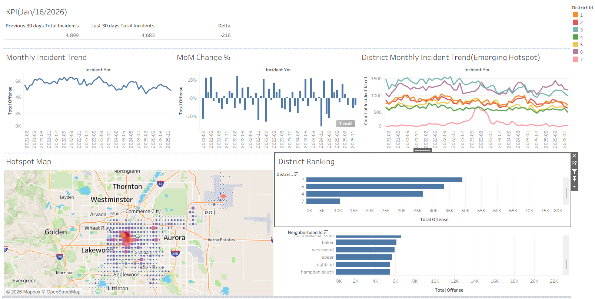
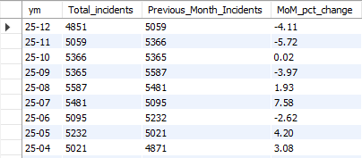
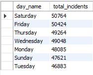
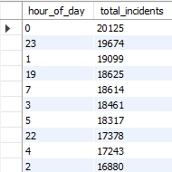
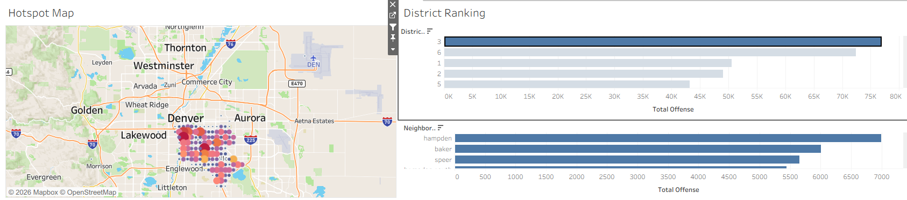
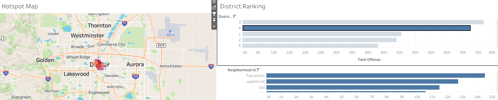

# Strategic Crime & Data Analysis for Resource Deployment  
### *Aurora Police Department – Crime & Data Analyst Case Study*

## What This Project Is Really About

Police departments are asked to make **time-sensitive decisions** every day:  
**Where should officers be deployed? When should staffing be adjusted? Which areas require immediate attention?**

This project was built to demonstrate **how a Crime & Data Analyst can use SQL and analytics to support those decisions**.

> **My goal with this project** is to show how raw crime data can be transformed into  
> **clear patterns, emerging hotspot insights, and concise monthly summaries**  
> that help command staff and district leadership make informed, data-driven decisions.

## What I Am Demonstrating

- Strategic crime pattern analysis (temporal & spatial)  
- SQL-based ETL and data validation  
- Hotspot trend detection  
- Real-time and monthly summary reporting  
- Translating analysis into **resource deployment insights**  
- Communicating findings clearly for **non-technical stakeholders**  

## Core Analytical Questions

1. **When** do crime incidents occur most frequently?  
2. **Where** are incidents concentrated?  
3. How can these insights inform **patrol planning, staffing, and enforcement priorities**?  

## Data Overview

- **Source:** Denver crime data(https://opendata-geospatialdenver.hub.arcgis.com/datasets/geospatialDenver::crime/about)
- **Structure:** RMS-style incident and offense records  
- **Records:** ~342,000 crime records  

## Data Architecture & ETL Workflow

### Staging Layer – `stg_crime_offenses`
- Raw data ingestion from CSV  
- Minimal transformation  
- Data quality and validation checks  

### Fact Layer – `fact_crime_offenses`
- Parsed and standardized date/time fields  
- Separation of **incident occurrence date** vs. **reported date**  
- Cleaned geographic and administrative attributes  

### Analytics Layer – `vw_crime_tableau`
- Derived time dimensions (month, day, hour)  
- Spatial grid fields for hotspot analysis  
- Optimized for Tableau dashboards  

## Tableau Dashboard

### Dashboard Screenshots
- Tableau Public Link: https://public.tableau.com/app/profile/jun.park5694/viz/Denver_Crime_visualization/Dashboard1?publish=yes
- Dashboard Action: 
1. Filtering district on Hotspot Map and Neighborhood Hotspots by selecting on District Ranking
2. Filtering district on Hotspot map by selecting on Neighborhood Ranking

## Analysis Framework

### Monthly & Real-Time Overview
- Month-over-month (MoM) changes  
Month-over-month analysis shows a consistent seasonal pattern, with incident volumes increasing during the summer months and declining during the winter months.

### Temporal Pattern Analysis
- Day-of-week patterns  
Day-of-week analysis indicates elevated incident volumes on Thursdays, Fridays, and Saturdays, suggesting increased activity toward the end of the week. 

- Hour-of-day analysis (nighttime focus)  
Hour-of-day analysis indicates elevated incident volumes between 9:00 PM and 4:00 AM, highlighting a concentration of activity during nighttime hours. 
 

### Spatial Pattern & Hotspot Analysis
- District and Neighborhood concentration  
 

## Recommendations

- Nighttime hour-of-day patterns reveal higher incident activity between 9:00 PM and 4:00 AM, providing actionable insight for overnight staffing and patrol allocation.
- Day-of-week trends reveal higher incident counts on Thursdays, Fridays, and Saturdays, providing useful insight for end-of-week staffing and resource allocation.  
- Month-over-month analysis reveals a clear seasonal pattern, where incident counts increase throughout the summer and decrease during the winter, providing useful context for proactive staffing and resource planning.  

## Skills Demonstrated

- SQL (ETL, analytics, window functions)  
- Data validation and QA  
- Strategic crime analysis  
- Dashboard-ready data modeling  

## Disclaimer

This project uses publicly available data for educational and portfolio purposes only.
